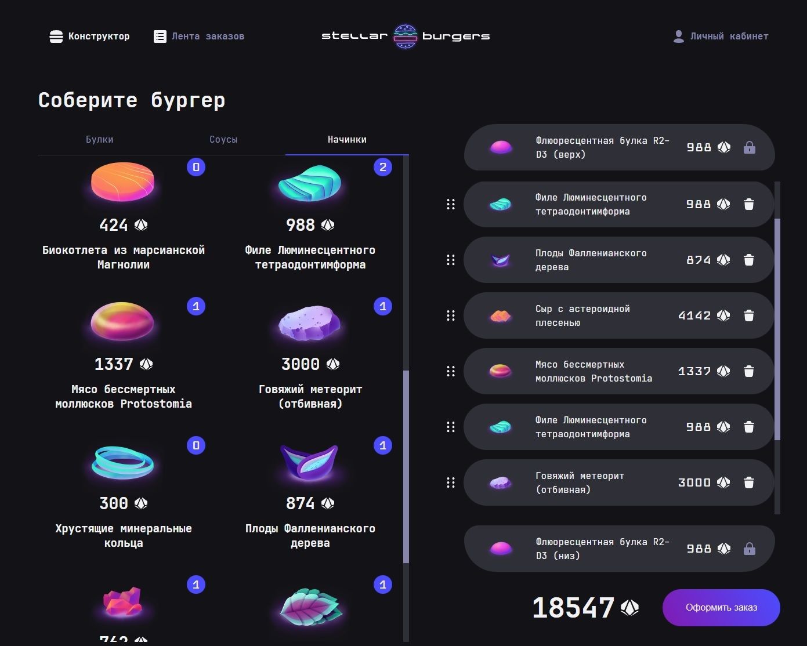

# Фронтенд дипломного проекта Yandex Practicum (fullstack)

**Информация о проекте:**

Космическая бургерная "Stellar burger" на React / Redux. Здесь можно заказать космический бургер мечты :)
В проекте можно:
1. Cоздать свой бургер перетаскиванием, с помощью Drag&Drop
2. Сформировать заказ и отправить его на сервер
3. Посмотреть ленту заказов в реальном времени с помощью WebSocket соединения

## Стек технологий:

* Typescript 
* React
* Redux (redux-thunk)
* React DND
* React--router-dom
* CSS-modules
* Websocket
* тесты на Jest и Cypress

Ссылка на Github pages: https://ekaanikeeva.github.io/react-burger/
